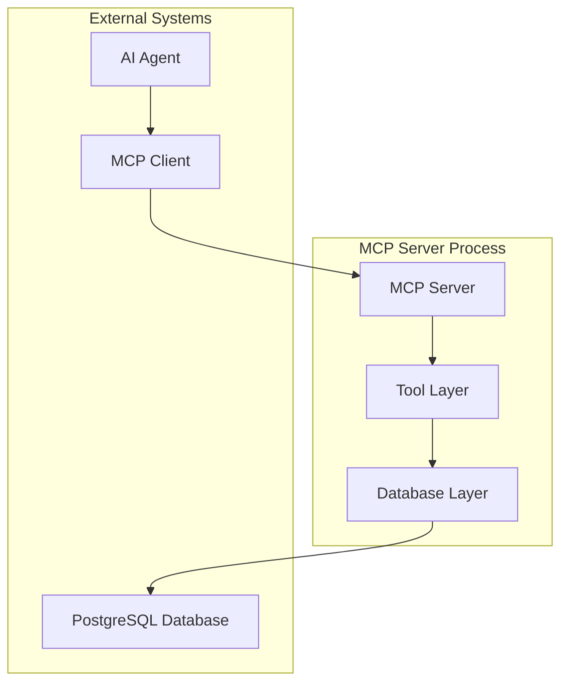

# Design Document: MCP Server & Task Tools

## Overview

This design specifies the implementation of a stateless MCP (Model Context Protocol) server that exposes todo task management operations as tools for AI agents. The server will be built using the official MCP Python SDK and will provide five core tools for task management: add_task, list_tasks, update_task, complete_task, and delete_task.

The server maintains no in-memory state and relies entirely on PostgreSQL database persistence through SQLModel ORM. All operations enforce strict user isolation to ensure data security in the multi-user environment.

## Architecture

The MCP server follows a layered architecture with clear separation of concerns:



### Key Architectural Principles

1. **Stateless Design**: No in-memory state between tool invocations
2. **Database-First**: All state persisted in PostgreSQL
3. **User Isolation**: Strict ownership validation for all operations
4. **Tool-Based Interface**: Each operation exposed as a discrete MCP tool
5. **Error Transparency**: Clear, structured error responses

## Components and Interfaces

### MCP Server Component

The main server component built using the official MCP Python SDK:

```python
from mcp.server.fastmcp import FastMCP
from mcp.types import Tool, TextContent

class TaskMCPServer:
    def __init__(self, database_url: str):
        self.mcp = FastMCP("task-management-server")
        self.db_layer = DatabaseLayer(database_url)
        self._register_tools()
    
    def _register_tools(self):
        # Register all five task management tools
        pass
```

### Database Layer Component

SQLModel-based data access layer for PostgreSQL operations:

```python
from sqlmodel import SQLModel, Session, create_engine, select
from typing import List, Optional

class DatabaseLayer:
    def __init__(self, database_url: str):
        self.engine = create_engine(database_url)
    
    def create_task(self, user_id: str, title: str, description: str = None) -> Task:
        # Implementation for task creation
        pass
    
    def get_user_tasks(self, user_id: str, status_filter: str = None) -> List[Task]:
        # Implementation for task retrieval
        pass
```

### Tool Interface Components

Each tool follows a consistent interface pattern:

```python
@mcp.tool()
def add_task(user_id: str, title: str, description: str = None) -> dict:
    """Add a new task for the specified user"""
    # Validation, database operation, response formatting
    pass
```

### Response Format Component

Standardized response structure for all tools:

```python
class ToolResponse:
    success: bool
    data: Optional[dict] = None
    error: Optional[str] = None
    error_code: Optional[str] = None
```

## Data Models

### Task Entity Model

The existing task model will be used without modification:

```python
from sqlmodel import SQLModel, Field
from datetime import datetime
from typing import Optional

class Task(SQLModel, table=True):
    id: Optional[int] = Field(default=None, primary_key=True)
    user_id: str = Field(index=True)
    title: str
    description: Optional[str] = None
    status: str = Field(default="pending")  # "pending" or "completed"
    created_at: datetime = Field(default_factory=datetime.utcnow)
    updated_at: Optional[datetime] = None
    completed_at: Optional[datetime] = None
```

### Tool Parameter Models

Input validation models for each tool:

```python
class AddTaskParams(BaseModel):
    user_id: str
    title: str
    description: Optional[str] = None

class UpdateTaskParams(BaseModel):
    user_id: str
    task_id: int
    title: Optional[str] = None
    description: Optional[str] = None
    status: Optional[str] = None
```

## Correctness Properties

*A property is a characteristic or behavior that should hold true across all valid executions of a system—essentially, a formal statement about what the system should do. Properties serve as the bridge between human-readable specifications and machine-verifiable correctness guarantees.*

Based on the prework analysis, the following properties validate the core correctness requirements:

**Property 1: Task Creation Completeness**
*For any* valid user_id and task title, creating a task should result in a new task entity with correct default values (pending status, created_at timestamp) and return the task details in structured JSON format.
**Validates: Requirements 2.1, 2.3, 2.4, 2.5**

**Property 2: User Task Isolation**
*For any* user_id, listing tasks should return only tasks belonging to that user, never tasks from other users, and should be ordered by created_at timestamp (newest first).
**Validates: Requirements 3.1, 3.3, 7.1, 7.3**

**Property 3: Task Update Consistency**
*For any* valid task update operation, the task should be modified with the new values, have its updated_at timestamp set to current time, and return the updated task details in structured JSON format.
**Validates: Requirements 4.1, 4.2, 4.3, 4.5**

**Property 4: Task Completion Idempotence**
*For any* task, completing it multiple times should result in the same final state (completed status, completed_at timestamp set) without errors.
**Validates: Requirements 5.1, 5.2, 5.3, 5.5**

**Property 5: Task Deletion Finality**
*For any* valid task deletion, the task should be permanently removed from the database and subsequent operations on that task_id should return "task not found" errors.
**Validates: Requirements 6.1, 6.5**

**Property 6: Access Control Enforcement**
*For any* task operation with a user_id that doesn't own the specified task, the operation should return an "access denied" error and not modify any data.
**Validates: Requirements 7.2, 7.4**

**Property 7: Parameter Validation Consistency**
*For any* tool invocation with missing required parameters or invalid parameter values, the server should return structured error responses with descriptive messages before attempting database operations.
**Validates: Requirements 2.2, 8.1, 8.4**

**Property 8: Response Format Uniformity**
*For any* tool operation (success or failure), the response should be valid JSON with consistent schema including success/error status and appropriate data or error information.
**Validates: Requirements 10.1, 10.2, 10.3, 10.4, 10.5**

**Property 9: Task Status Filtering**
*For any* user's task list with status filtering applied, all returned tasks should match the specified status filter and maintain proper ordering.
**Validates: Requirements 3.2**

**Property 10: Data Persistence Across Restarts**
*For any* task data created before server restart, the data should remain accessible and unchanged after server restart.
**Validates: Requirements 1.5**

**Property 11: Database Transaction Atomicity**
*For any* database operation that fails partway through, the database should remain in a consistent state with no partial updates.
**Validates: Requirements 9.5**

## Error Handling

The MCP server implements comprehensive error handling with consistent response formats:

### Error Categories

1. **Validation Errors**: Invalid or missing parameters
2. **Authorization Errors**: User access violations
3. **Not Found Errors**: Non-existent task IDs
4. **Database Errors**: Connection or query failures
5. **System Errors**: Unexpected server errors

### Error Response Format

All errors follow a consistent JSON structure:

```json
{
  "success": false,
  "error": "Descriptive error message",
  "error_code": "ERROR_TYPE",
  "details": {
    "field": "Additional context"
  }
}
```

### Error Handling Strategies

- **Input Validation**: Validate all parameters before database operations
- **User Authorization**: Verify task ownership for all operations
- **Database Resilience**: Handle connection failures gracefully
- **Logging**: Record security violations and system errors
- **Graceful Degradation**: Return meaningful errors instead of crashes

## Testing Strategy

The testing approach combines unit tests for specific scenarios with property-based tests for comprehensive validation:

### Unit Testing

Unit tests focus on:
- Specific examples of each tool operation
- Edge cases like empty task lists
- Error conditions with invalid inputs
- Database connection failure scenarios
- Integration between MCP server and database layer

### Property-Based Testing

Property-based tests validate universal correctness properties using **Hypothesis** (Python's property-based testing library):

- **Configuration**: Minimum 100 iterations per property test
- **Test Tagging**: Each test references its design document property
- **Tag Format**: `# Feature: mcp-server-task-tools, Property {number}: {property_text}`
- **Coverage**: Each correctness property implemented as a single property-based test

### Test Organization

```
tests/
├── unit/
│   ├── test_add_task.py
│   ├── test_list_tasks.py
│   ├── test_update_task.py
│   ├── test_complete_task.py
│   └── test_delete_task.py
├── property/
│   ├── test_task_properties.py
│   └── test_security_properties.py
└── integration/
    └── test_mcp_server_integration.py
```

### Testing Dependencies

- **pytest**: Test framework
- **hypothesis**: Property-based testing library
- **pytest-asyncio**: Async test support
- **sqlmodel**: Database testing utilities
- **mcp**: MCP SDK testing tools

The dual testing approach ensures both concrete behavior validation (unit tests) and universal correctness guarantees (property tests), providing comprehensive coverage for the MCP server implementation.