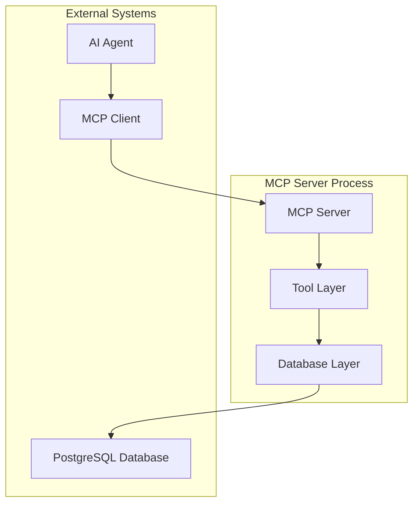

# MCP Server - Task Management Tools

This MCP (Model Context Protocol) server exposes todo task management operations as tools for AI agents. The server provides a stateless interface to manage tasks in a multi-user todo application, ensuring proper user isolation and data persistence through PostgreSQL.

## Features

- **Stateless Design**: No in-memory state between tool invocations
- **Five Core Tools**: add_task, list_tasks, update_task, complete_task, delete_task
- **User Isolation**: Strict ownership validation for all operations
- **PostgreSQL Integration**: Uses existing database schema with SQLModel ORM
- **Comprehensive Error Handling**: Structured error responses with descriptive messages

## Tools

1. **add_task**: Create new tasks for users
2. **list_tasks**: Retrieve tasks with optional status filtering
3. **update_task**: Modify existing task details
4. **complete_task**: Mark tasks as completed
5. **delete_task**: Permanently remove tasks

## Project Structure

```
mcp-server/
├── src/                    # Source code
│   ├── models/            # Data models
│   │   ├── __init__.py
│   │   └── task.py        # Task models (Task, TaskCreate, TaskUpdate, TaskResponse)
│   ├── database/          # Database layer
│   │   ├── __init__.py
│   │   └── layer.py       # DatabaseLayer class with CRUD operations
│   ├── tools/             # MCP tools (to be implemented)
│   │   └── __init__.py
│   ├── config.py          # Configuration management
│   └── server.py          # Main MCP server implementation
├── tests/                 # Test suite
│   ├── unit/              # Unit tests
│   ├── property/          # Property-based tests
│   ├── integration/       # Integration tests
│   └── test_setup.py      # Basic setup tests
├── requirements.txt       # Production dependencies
├── requirements-dev.txt   # Development dependencies
├── pyproject.toml         # Project configuration
├── Makefile              # Development commands
├── setup.py              # Environment setup script
├── .env.example          # Environment variables template
├── .gitignore            # Git ignore rules
└── README.md             # This file
```

## Quick Start

1. **Setup Environment**:
   ```bash
   python setup.py
   ```

2. **Configure Database**:
   ```bash
   cp .env.example .env
   # Edit .env with your database URL
   ```

3. **Validate Setup**:
   ```bash
   make validate
   ```

4. **Run Tests**:
   ```bash
   make test
   ```

5. **Start Server** (when implemented):
   ```bash
   make run
   ```

## Development Commands

- `make help` - Show available commands
- `make install` - Install production dependencies
- `make install-dev` - Install development dependencies
- `make test` - Run all tests
- `make test-unit` - Run unit tests only
- `make test-property` - Run property-based tests only
- `make lint` - Run linting checks
- `make format` - Format code with black and isort
- `make clean` - Clean up temporary files

## Architecture

The server follows a layered architecture:



### Key Components

- **MCP Server**: Built with FastMCP, handles tool registration and execution
- **Database Layer**: SQLModel-based data access with user isolation
- **Task Models**: Adapts existing database schema to MCP API format
- **Error Handling**: Comprehensive error responses with proper status codes

## Database Schema Compatibility

The MCP server works with the existing database schema:

- Uses existing `task` table with UUID primary keys
- Adapts `is_completed` boolean to `status` string ("pending"/"completed")
- Maintains user isolation through `user_id` foreign key
- Preserves `created_at` and `updated_at` timestamps

## Testing Strategy

- **Unit Tests**: Specific examples and edge cases
- **Property-Based Tests**: Universal correctness properties using Hypothesis
- **Integration Tests**: End-to-end workflows with database

## Requirements Traceability

This implementation satisfies all requirements from `.kiro/specs/mcp-server-task-tools/`:

- **Requirement 1**: MCP Server Foundation ✓
- **Requirement 2**: Task Creation Tool (in progress)
- **Requirement 3**: Task Retrieval Tool (in progress)
- **Requirement 4**: Task Modification Tool (in progress)
- **Requirement 5**: Task Completion Tool (in progress)
- **Requirement 6**: Task Deletion Tool (in progress)
- **Requirement 7**: User Isolation and Security ✓
- **Requirement 8**: Error Handling and Validation ✓
- **Requirement 9**: Database Integration ✓
- **Requirement 10**: Tool Response Format ✓

## Next Steps

The foundation is complete. Next tasks in the implementation plan:

1. Implement database layer and models (Task 2)
2. Implement MCP server foundation (Task 3)
3. Implement individual tools (Tasks 4-9)
4. Add comprehensive security and validation (Task 10)
5. Implement error handling and response formatting (Task 11)

See `.kiro/specs/mcp-server-task-tools/tasks.md` for the complete implementation plan.